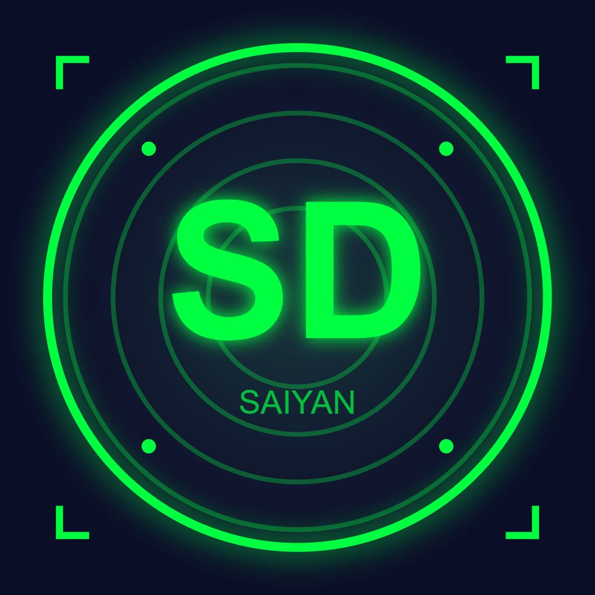

# 🐉 SaiyanDex - Dragon Ball Character Database

<div align="center">



**A feature-rich React Native mobile application for exploring the Dragon Ball universe**

[](https://reactnative.dev/)
[](https://expo.dev/)
[](https://www.typescriptlang.org/)
[](LICENSE)

[Features](#features) • [Screenshots](#screenshots) • [Installation](#installation) • [Usage](#usage) • [Tech Stack](#tech-stack)

</div>

---

## 📱 About The Project

**SaiyanDex** is a modern, professionally-designed React Native application that serves as a comprehensive database for Dragon Ball characters, planets, and transformations. Built with TypeScript and Expo SDK 52, it demonstrates advanced mobile development concepts including API integration, state management, animations, and persistent storage.

### 🎯 Project Requirements

This project was built to fulfill the following requirements:

- **React Native with Expo** - Built using Expo SDK 52  
- **React Navigation Only** - No Expo Router, pure React Navigation implementation  
- **Public API Integration** - Dragon Ball API (https://dragonball-api.com)  
- **Multiple Screens** - Characters, Planets, Favorites, Settings with proper navigation  
- **Structured UI** - Clean, professional, and responsive design  
- **Meaningful Interactions** - Search, filter, favorites, detail views  
- **Loading States** - Proper loading indicators and error handling  
- **Individual Design** - Unique Scouter Vision theme with custom animations  

---

## ✨ Features

### Core Functionality
- **Browse Characters** - Explore 50+ Dragon Ball characters with detailed information
- **Explore Planets** - Discover planets from across the Dragon Ball universe
- **Favorites System** - Save your favorite characters locally with AsyncStorage
- **Theme Switching** - Toggle between Dark (Scouter Vision) and Light modes
- **Advanced Search** - Real-time character search with instant results
- **Race Filtering** - Filter characters by race (Saiyan, Namekian, etc.)

### Advanced Features
- **Smooth Animations** - Floating cards, pulsing auras, rotating planets
- **Power Level Meters** - Animated progress bars showing character strength
- **Energy Auras** - Dynamic glowing effects with race-specific colors
- **Transformation Gallery** - View all character transformation forms
- **Pull to Refresh** - Update data with a simple swipe gesture
- **Haptic Feedback** - Tactile responses for button presses
- **Data Persistence** - Favorites and theme preferences saved locally
- **Share Feature** - Share character details with friends

### UI/UX Excellence
- **Scouter HUD Overlay** - Futuristic scanning interface
- **Professional Design** - Clean, modern, and consistent UI
- **Responsive Layout** - Works perfectly on all screen sizes
- **Dark Mode First** - Beautiful Scouter Vision theme by default
- **Fast Performance** - Optimized rendering and smooth scrolling
- **Empty States** - Helpful messages when no data is available
- **Loading States** - Beautiful animated spinners

---

## 📸 Screenshots

<div align="center">

| Characters List | Character Detail | Planets | Favorites |
|----------------|------------------|---------|-----------|
|  |  |  |  |

| Settings Dark | Settings Light | Search | Filter |
|--------------|----------------|--------|--------|
|  |  |  |  |

</div>

---

## 🚀 Installation

### Prerequisites

Before you begin, ensure you have the following installed:

- **Node.js** (v18 or higher) - [Download](https://nodejs.org/)
- **npm** or **yarn** - Comes with Node.js
- **Expo Go** app on your phone ([iOS](https://apps.apple.com/app/expo-go/id982107779) | [Android](https://play.google.com/store/apps/details?id=host.exp.exponent))
- **Git** - [Download](https://git-scm.com/)

### Step-by-Step Setup

1. **Clone the repository**
```bash
   git clone https://github.com/yourusername/saiyandex.git
   cd saiyandex
```

2. **Install dependencies**
```bash
   npm install
   # or
   yarn install
```

3. **Start the development server**
```bash
   npx expo start
```

4. **Run on your device**
   - Scan the QR code with Expo Go (Android)
   - Scan the QR code with Camera app (iOS)
   - Wait for the app to build and load

### Alternative: Run on Emulator

**Android Emulator:**
```bash
npx expo start --android
```

**iOS Simulator (Mac only):**
```bash
npx expo start --ios
```

---

## 📂 Project Structure
```
SaiyanDex/
├── App.tsx                          # Main app entry point
├── app.json                         # Expo configuration
├── tsconfig.json                    # TypeScript configuration
├── package.json                     # Dependencies and scripts
│
├── assets/                          # Static assets
│   ├── icon.png                     # App icon (1024x1024)
│   ├── splash.png                   # Splash screen
│   ├── adaptive-icon.png            # Android adaptive icon
│   └── favicon.png                  # Web favicon
│
├── src/                             # Source code
│   ├── types/                       # TypeScript type definitions
│   │   └── index.ts                 # All interfaces and types
│   │
│   ├── theme/                       # Theme configuration
│   │   ├── colors.ts                # Color definitions
│   │   └── themes.ts                # Theme objects
│   │
│   ├── utils/                       # Utility functions
│   │   ├── constants.ts             # App constants
│   │   └── helpers.ts               # Helper functions
│   │
│   ├── services/                    # External services
│   │   |── api.ts                   # API service (Dragon Ball API)
|   |   └── storage.ts 
│   │
│   ├── context/                     # React Context (State Management)
│   │   ├── ThemeContext.tsx         # Theme provider and hook
│   │   └── FavoritesContext.tsx     # Favorites provider and hook
│   │
│   ├── components/                  # Reusable UI components
│   │   ├── LoadingSpinner.tsx       # Loading indicator
│   │   ├── EmptyState.tsx           # Empty state message
│   │   ├── PowerLevelMeter.tsx      # Animated power bar
│   │   ├── EnergyAura.tsx           # Pulsing glow effect
│   │   ├── ScannerOverlay.tsx       # Scouter HUD overlay
│   │   ├── CharacterCard.tsx        # Character card component
│   │   └── PlanetCard.tsx           # Planet card component
│   │
│   ├── screens/                     # App screens
│   │   ├── characters/
│   │   │   ├── CharacterListScreen.tsx    # Characters list
│   │   │   └── CharacterDetailScreen.tsx  # Character details
│   │   ├── planets/
│   │   │   ├── PlanetListScreen.tsx       # Planets list
│   │   │   └── PlanetDetailScreen.tsx     # Planet details
│   │   ├── favorites/
│   │   │   └── FavoritesScreen.tsx        # Favorites list
│   │   └── settings/
│   │       └── SettingsScreen.tsx         # Settings screen
│   │
│   └── navigation/                  # Navigation configuration
│       ├── AppNavigator.tsx         # Root navigator
│       ├── TabNavigator.tsx         # Bottom tab navigator
│       ├── CharacterStack.tsx       # Characters stack
│       └── PlanetStack.tsx          # Planets stack
│
└── docs/                            # Documentation
    └── screenshots/                 # App screenshots
```

### 📁 Folder Explanations

| Folder | Purpose |
|--------|---------|
| **types/** | TypeScript interfaces and type definitions for type safety |
| **theme/** | Color schemes and theme objects for light/dark modes |
| **utils/** | Reusable utility functions and constants |
| **services/** | API integration and external service calls |
| **context/** | React Context for global state management |
| **components/** | Reusable UI components used across screens |
| **screens/** | Main app screens organized by feature |
| **navigation/** | Navigation structure and routing configuration |

---

## 🛠️ Tech Stack

### Core Technologies

| Technology | Version | Purpose |
|-----------|---------|---------|
| **React Native** | 0.83.4 | Mobile app framework |
| **Expo** | ~55.0.9 | Development platform |
| **TypeScript** | 5.9.2 | Type-safe JavaScript |
| **React** | 19.2.0 | UI library |

### Navigation

| Package | Purpose |
|---------|---------|
| **@react-navigation/native** | Navigation framework |
| **@react-navigation/stack** | Stack navigation |
| **@react-navigation/bottom-tabs** | Tab navigation |
| **react-native-screens** | Native screen optimization |
| **react-native-safe-area-context** | Safe area handling |

### State Management & Storage

| Package | Purpose |
|---------|---------|
| **React Context API** | Global state management |
| **@react-native-async-storage/async-storage** | Local data persistence |

### UI & Animations

| Package | Purpose |
|---------|---------|
| **expo-linear-gradient** | Gradient backgrounds |
| **expo-blur** | Blur effects |
| **react-native-reanimated** | High-performance animations |
| **react-native-animatable** | Pre-built animations |
| **react-native-gesture-handler** | Touch gestures |
| **expo-haptics** | Haptic feedback |

### API & Data

| Package | Purpose |
|---------|---------|
| **axios** | HTTP client for API calls |
| **Dragon Ball API** | Character and planet data |

### Development Tools

| Tool | Purpose |
|------|---------|
| **ESLint** | Code linting |
| **Prettier** | Code formatting |
| **TypeScript** | Type checking |

---

## 🔌 API Integration

### Dragon Ball API

**Base URL:** `https://dragonball-api.com/api`

**Endpoints Used:**
- `GET /characters` - Fetch all characters
- `GET /characters/:id` - Get character details
- `GET /planets` - Fetch all planets
- `GET /planets/:id` - Get planet details

**Example Response:**
```json
{
  "items": [
    {
      "id": 1,
      "name": "Goku",
      "ki": "60000000",
      "maxKi": "90000000000000000000",
      "race": "Saiyan",
      "gender": "Male",
      "description": "El protagonista de la serie...",
      "image": "https://dragonball-api.com/characters/goku_normal.webp",
      "affiliation": "Z Fighter"
    }
  ]
}
```

---

## 💡 Usage Guide

### Basic Navigation

1. **Characters Tab** - Browse all Dragon Ball characters
2. **Planets Tab** - Explore planets from the series
3. **Favorites Tab** - View your saved favorite characters
4. **Settings Tab** - Customize app preferences

### Key Features

**Search Characters:**
1. Go to Characters tab
2. Type in the search bar
3. Results update in real-time

**Filter by Race:**
1. Go to Characters tab
2. Tap on race filters (Saiyan, Namekian, etc.)
3. View filtered results

**Add to Favorites:**
1. Tap any character card
2. Press the heart icon in the top right
3. Character saved to Favorites tab

**Switch Theme:**
1. Go to Settings tab
2. Toggle the Dark/Light mode switch
3. Theme changes instantly and persists

**Share Character:**
1. Open character details
2. Tap share icon in header
3. Choose sharing method

---

## 🎨 Design Philosophy

### Scouter Vision Theme

The app's design is inspired by the **Scouter** devices from Dragon Ball Z:

- **Neon Green HUD** - Mimics the scouter display
- **Corner Brackets** - Scanning interface elements
- **Scanning Line** - Animated line moving across screen
- **Energy Auras** - Characters glow with race-specific colors
- **Power Level Meters** - Animated bars showing strength

### Color Psychology

**Dark Mode (Default):**
- Deep space blue backgrounds create focus
- Neon green accents for high contrast
- Glowing effects enhance sci-fi feel

**Light Mode:**
- Clean white backgrounds for readability
- Orange accents for warmth
- Subtle shadows for depth

---

## 🏗️ Architecture

### Component Structure
```
App Component
└── Providers (Theme, Favorites)
    └── Navigation Container
        └── Tab Navigator
            ├── Character Stack
            │   ├── Character List
            │   └── Character Detail
            ├── Planet Stack
            │   ├── Planet List
            │   └── Planet Detail
            ├── Favorites Screen
            └── Settings Screen
```

### State Management

**Global State (Context API):**
- Theme preferences (dark/light mode)
- Favorite characters array
- Loading states

**Local State (useState):**
- Search queries
- Filter selections
- UI states

**Persistent Storage (AsyncStorage):**
- Favorites list
- Theme preference

---

## 🧪 Testing

### Manual Testing Checklist

- [ ] App launches without errors
- [ ] Characters load correctly
- [ ] Can navigate to character details
- [ ] Can add/remove favorites
- [ ] Favorites persist after app restart
- [ ] Theme toggle works
- [ ] Theme persists after app restart
- [ ] Search functionality works
- [ ] Filter functionality works
- [ ] Pull to refresh updates data
- [ ] Animations are smooth
- [ ] Loading states display correctly
- [ ] Empty states show when needed
- [ ] Share feature works
- [ ] All navigation flows work

---

## 🚧 Troubleshooting

### Common Issues

**Issue: "Cannot find module" error**
```bash
# Solution:
rm -rf node_modules
npm install
npx expo start --clear
```

**Issue: "Reanimated plugin not found"**
```bash
# Solution: Check babel.config.js includes:
plugins: ['react-native-reanimated/plugin']

# Then clear cache:
npx expo start --clear
```

**Issue: App shows blank screen**
```bash
# Solution: Check console for errors
# Clear cache and restart:
npx expo start --clear
```

**Issue: Network request failed**
```bash
# Solution: 
# 1. Check internet connection
# 2. Verify API is accessible
# 3. Try refreshing the app
```

---

## 📊 Performance Optimizations

- **FlatList** for efficient scrolling
- **useCallback** to prevent unnecessary re-renders
- **React.memo** on list items
- **Image caching** with React Native Image
- **Debounced search** for better performance
- **Lazy loading** of character transformations

---

## 🔜 Future Enhancements

- [ ] Offline mode with local database
- [ ] Character comparison feature
- [ ] Battle simulator
- [ ] Achievement system
- [ ] Social features (share favorites)
- [ ] Widget support for iOS/Android
- [ ] Voice search
- [ ] Augmented Reality character viewer
- [ ] Push notifications for new characters
- [ ] Multi-language support

---

## 📝 License

This project is licensed under the MIT License - see the [LICENSE](LICENSE) file for details.

---

## 👨‍💻 Author

**Your Name**
- GitHub: [Dwivedi-03](https://github.com/Dwivedi-03)
- Email: djyoti436@gmail.com

---

## Acknowledgments

- **Dragon Ball API** - For providing comprehensive character data
- **Akira Toriyama** - Creator of Dragon Ball
- **Expo Team** - For the amazing development platform
- **React Navigation** - For robust navigation solutions
- **Community** - For inspiration and support

---

## Support

If you have any questions or need help:

1. Check the [Troubleshooting](#troubleshooting) section
2. Search existing [Issues](https://github.com/Dwivedi-03/saiyandex)
3. Create a new issue with detailed description
4. Email: djyoti436@gmail.com

---

<div align="center">

**Made with ❤️ and ⚡ by Jyoti Dwivedi**

If you found this project helpful, please consider giving it a ⭐!

</div>

---